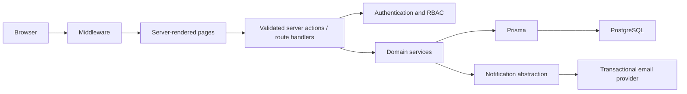

# Release 1 Architecture

## System shape

Kingsley Hall Staff Leave is a modular Next.js application. React server components and server actions form the delivery layer; feature services own business rules; Prisma repositories provide typed PostgreSQL access. Browser code never decides authorisation or leave balances.

## Main dependencies

- Next.js, React and TypeScript for the full-stack application.
- Prisma and PostgreSQL for migrations and typed persistence.
- Zod for boundary validation.
- bcryptjs for adaptive password hashing.
- Vitest for unit and service tests; Playwright is planned for Phase 11 E2E.

## Authentication design

Email/password credentials are checked only on the server. Passwords use bcrypt cost 12. A successful login creates a random opaque token; only its SHA-256 hash is stored in PostgreSQL. The cookie is HttpOnly, SameSite=Lax, Secure in production, path-scoped and expires after seven days. Disabled users cannot create or use sessions. Password reset will use single-use, hashed, expiring tokens when email delivery is implemented. The `User` boundary allows future OIDC Microsoft/Google identities without changing employee records.

## Permission model

Users may hold several roles. Permissions are additive, but resource scope is checked independently: a manager's `leave:review:reports` grant is necessary but not sufficient; the requested employee must be in that manager's reporting hierarchy and organisation. HR and super-admin operations require organisation matching. UI visibility is convenience only; every server action and API handler calls the same authorisation policies.

## Leave calculation design

Hours are the canonical unit. `LeaveCalculationService` will obtain the working-pattern version effective on each requested date, skip zero-hour days, apply configured bank-holiday policy, and sum scheduled hours. Entitlement is `base + carried forward + manual adjustments`; approved requests reduce remaining balance, while pending requests produce a separate potential balance. Date-only business values will be represented consistently in the organisation timezone. Overlap checks use database transactions and range predicates to avoid race conditions.

## Deployment

A stateless Next.js service connects to managed PostgreSQL over TLS. Secrets are environment variables. Migrations run as a release task, not on every request. Recommended production controls include HTTPS, database backups/PITR, central error logging, email domain authentication, secret rotation, and health monitoring.

## Future growth

Feature modules communicate through identifiers and services. Release 2 absence/calendar integrations and Release 3 rota/timesheet modules can add tables and events without changing authentication or core employment identities. Before SaaS commercialisation, enforce tenant context at every repository boundary, add PostgreSQL row-level security as defence in depth, use tenant-aware uniqueness constraints, and test cross-tenant denial systematically.
