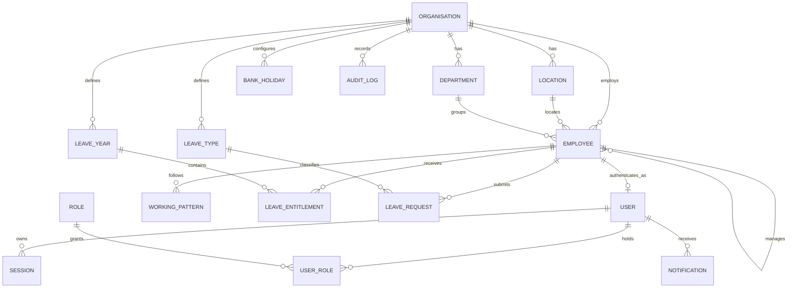

# Database ERD

The full target Release 1 model is shown here; Phase 1 implements the shaded foundation subset (`Organisation`, `Employee`, `User`, `Role`, `UserRole`, `Session`). Remaining entities arrive in their scheduled phases.

All tenant-owned records carry `organisationId` directly or are reached through an immutable tenant-owned parent. History-bearing records use status/active flags rather than hard deletion. Monetary values are absent; leave hours use fixed-precision database decimals in the later leave migration.
