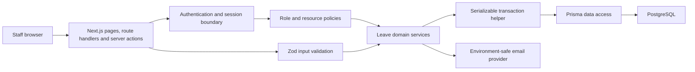

# Production Architecture

## System boundaries

## Responsibilities

- `src/app`: delivery only—pages, route handlers and server-action entry points.
- `src/features/auth`: authentication, role permissions and resource-level scope decisions.
- `src/features/leave`: leave validation, calculations, approval policy and orchestration.
- `src/lib`: database client, validated server configuration, and transaction infrastructure.
- `src/services`: external service abstractions such as transactional email.
- `prisma`: schema and tracked migrations; development fixtures are explicitly isolated.

Business rules must be callable without React. Frontend visibility is never an authorisation control. Every resource access must combine role permission with organisation and ownership/manager scope.

## Configuration

`serverConfig()` validates application URL, database URL, authentication secret, application name, organisation name, and timezone. Secrets remain environment variables. Development fixtures and console email contain explicit production guards.

## Access control

The role grant table answers whether a capability exists. Resource policies separately answer whether the authenticated actor may access a particular employee or leave request. Cross-organisation access is denied even to elevated roles. Employee detail now applies this policy before rendering, and leave submission resolves the selected leave type within the employee's active organisation configuration.

## Leave and transaction model

Hours are canonical. Pure calculation functions handle effective workdays, half days, bank holidays, entitlement, and overlap rules. Mutating leave operations use serializable transactions with bounded retry for PostgreSQL serialization/deadlock conflicts.

Full balance and overlap revalidation must ultimately occur inside the same transaction as approval. Stage 3 adds the shared transaction primitive; Stage 7 will pair it with database constraints and PostgreSQL-backed concurrency tests.

## Validation and errors

Externally supplied leave requests and decisions use central Zod schemas. Expected validation failures return safe user-facing messages. Internal database and provider errors must not expose infrastructure details.

## Verification boundary

Unit tests cover calculation, grants, approval policy, employee resource isolation, configuration, demo guards, email guards, and input schemas. PostgreSQL integration and browser journeys remain required before production.
