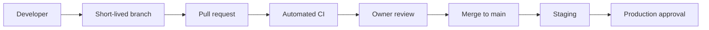

# GitHub Workflow

`main` represents reviewed production-quality source. Use short-lived feature, fix, production-preparation, or hotfix branches. Do not force-push shared branches or commit routine work directly to `main`.

## Required branch-protection settings

Configure a GitHub ruleset targeting `main`:

- require a pull request before merging;
- require at least one approval;
- dismiss stale approvals when new commits are pushed;
- require review from CODEOWNERS where supported;
- require the CI `validate` job to pass;
- require branches to be up to date before merging;
- block force pushes and branch deletion;
- restrict bypass to explicitly authorised emergency administrators;
- require conversation resolution.

These settings require repository-owner access and cannot be guaranteed by files in the repository. Record the date and approver when enabled.

## Emergency changes

Use a `hotfix/…` branch, retain review and CI wherever possible, document the incident and rollback, and follow with a retrospective. Emergency access must not become the routine workflow.
