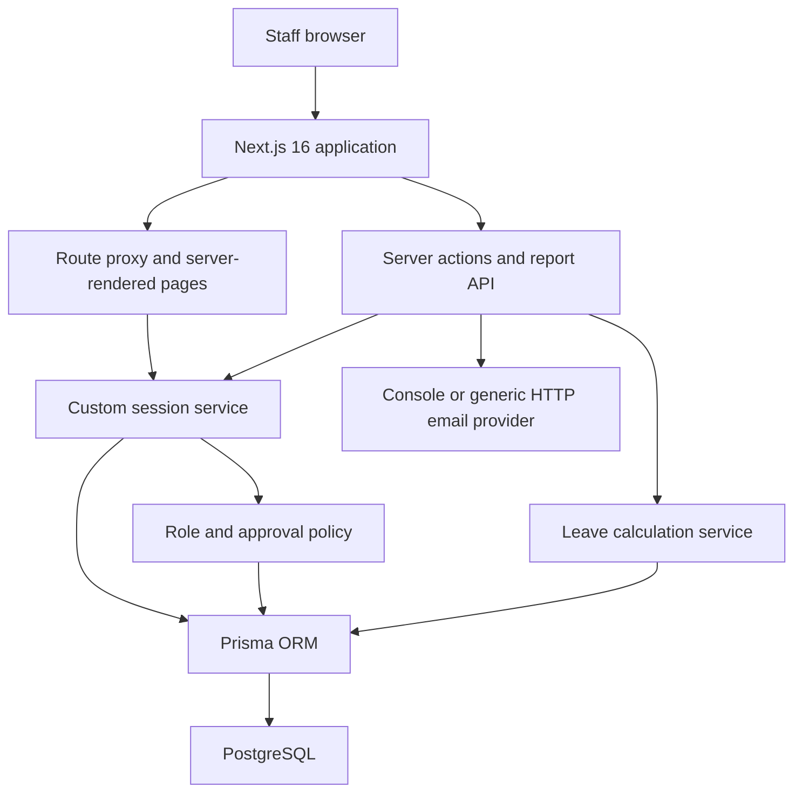

# Kingsley Hall Staff Leave — Production Readiness Audit

Audit date: 14 August 2026  
Audited baseline: `main` at `25e225c`  
Audit branch: `production/audit`

## Executive summary

The application is a credible Release 1 foundation, but it must not be deployed to production. It has server-rendered role checks, organisation-aware queries in several important paths, bcrypt password hashing, opaque hashed sessions, validation, a tracked PostgreSQL migration, and useful unit tests. However, production blockers remain in tenant isolation, demo-data controls, authentication abuse protection, password recovery, transactional leave integrity, testing, and operations.

No production credentials were found in tracked application source. The documented demo password must be treated as compromised and must never be reused.

## Architecture

### Technology inventory

- Frontend and backend: Next.js 16 App Router, React 19, TypeScript.
- Application entry points: `src/app/**`, server actions, and the CSV report route.
- Database: PostgreSQL through Prisma 6; one checked-in foundation migration.
- Authentication: custom email/password login using bcrypt and database-backed opaque sessions.
- Authorisation: additive roles (`EMPLOYEE`, `MANAGER`, `HR_ADMIN`, `SUPER_ADMIN`) plus route/layout checks and an approval policy helper.
- Validation: Zod on login and leave submission; ad-hoc validation elsewhere.
- Email: development console provider or generic bearer-authenticated HTTP endpoint.
- File storage and background jobs: none.
- Tests: Vitest unit tests only.
- Deployment: standalone Next.js Dockerfile; no CI, staging, health check, monitoring, or deployment workflow.

## Positive controls already present

- Passwords are hashed with bcrypt cost 12.
- Session tokens are generated with cryptographic randomness; only SHA-256 hashes are stored.
- Session cookies are HttpOnly, SameSite=Lax, and Secure in production.
- Inactive users cannot authenticate or reuse a session.
- Login errors do not reveal whether an account exists.
- Employee leave history is scoped to the authenticated employee.
- Manager approval uses server-side organisation, hierarchy, and self-approval checks.
- Admin routes have a server-side HR/Super Admin layout gate.
- Leave input uses server-side Zod validation and overlap/balance checks.
- Leave submission and review writes use Prisma transactions and create audit records.
- The schema contains useful uniqueness constraints and indexes.
- Responses include frame denial, MIME sniffing protection, and a referrer policy.

## Findings

### CRITICAL

#### C-01 — Production seed creates shared-password privileged demo accounts

- Problem: `prisma/seed.ts` contains a known plaintext demo password and creates active Super Admin, HR, manager, and employee accounts plus fictional leave records. There is no production-environment guard.
- Affected code: `prisma/seed.ts`; `package.json` seed commands; demo credentials in `README.md`.
- Risk: an accidental production seed would create immediately exploitable privileged accounts and contaminate staff records.
- Recommended fix: separate development fixtures from production initialisation; refuse demo seeding when `NODE_ENV=production` or the database is not explicitly marked disposable; create the first administrator through a single-use invitation/reset process.
- Blocks production: Yes.

### HIGH

#### H-01 — Cross-organisation employee-detail IDOR

- Problem: `/admin/employees/[id]` fetches solely by employee ID. The parent layout verifies an admin role but the detail query does not require the employee to belong to the actor's organisation.
- Affected code: `src/app/admin/employees/[id]/page.tsx`.
- Risk: an HR/Super Admin account in one organisation could view another organisation's employee record if an identifier becomes known.
- Recommended fix: query by both employee ID and authenticated organisation, returning not found when the scope does not match; add a regression test.
- Blocks production: Yes.

#### H-02 — Leave type is not organisation-scoped during submission

- Problem: the submitted `leaveTypeId` is validated only as a non-empty string. The action does not verify that it is active and belongs to the employee's organisation.
- Affected code: `src/features/leave/actions.ts`.
- Risk: a crafted request can reference a leave type from another tenant and bypass intended organisational configuration.
- Recommended fix: resolve the leave type with organisation and active-state constraints before calculating or writing; reject unknown IDs.
- Blocks production: Yes.

#### H-03 — Concurrent requests and approvals can overdraw entitlement

- Problem: available balance and overlaps are read before the write transaction. Approval does not re-check balance or overlaps. Two concurrent operations can both pass validation.
- Affected code: `src/features/leave/actions.ts`; database constraints do not serialize entitlement consumption.
- Risk: approved leave can exceed entitlement or create conflicting requests, producing payroll/HR data-integrity errors.
- Recommended fix: implement a transactionally locked approval/request strategy with a canonical balance service and repeat validation inside the transaction; add concurrency integration tests.
- Blocks production: Yes.

#### H-04 — No login rate limiting or abuse controls

- Problem: login performs an expensive bcrypt comparison without per-account/IP throttling, delay, lockout policy, or monitoring.
- Affected code: `src/features/auth/actions.ts`.
- Risk: credential stuffing, password guessing, and resource exhaustion.
- Recommended fix: add privacy-conscious rate controls backed by shared production storage, security events, and a documented lockout/support policy.
- Blocks production: Yes.

#### H-05 — Password reset and secure account invitation are not implemented

- Problem: the reset page is informational and employee creation has no working invitation flow.
- Affected code: `src/app/forgot-password/page.tsx`; `src/app/admin/employees/new/page.tsx`; user schema.
- Risk: staff cannot securely recover accounts or be onboarded without manual/unsafe credential handling.
- Recommended fix: implement single-use hashed tokens, short expiry, invalidation after use, generic responses, rate limiting, and transactional email delivery. Never email passwords.
- Blocks production: Yes.

#### H-06 — Test coverage does not exercise database or browser security boundaries

- Problem: the 21 tests cover pure calculations, permission helpers, and token hashing only. There are no database integration or end-to-end tests for login, tenant isolation, approvals, cancellation, or admin access.
- Affected code: `tests/**`; no Playwright configuration.
- Risk: critical access-control and data-integrity regressions can pass the current suite.
- Recommended fix: add PostgreSQL-backed integration tests and Playwright journeys, including employee-to-employee denial, cross-organisation denial, manager scope, and admin scope.
- Blocks production: Yes.

### MEDIUM

#### M-01 — Approved-leave cancellation workflow is incomplete

- Problem: cancelling approved future leave only sets `cancellationRequestedAt`; no review action completes or rejects that request.
- Affected code: `src/features/leave/actions.ts` and manager UI.
- Risk: balances and employee expectations can remain indefinitely inconsistent.
- Recommended fix: implement and test the complete cancellation approval state machine and audit trail.
- Blocks production: Yes, for the promised workflow.

#### M-02 — Leave calculations ignore employment boundaries and historical working-pattern changes

- Problem: request calculation uses the working pattern effective today, not the pattern applicable to each requested date, and does not enforce start/end employment dates.
- Affected code: `requestContext()` and `calculateRequestedHours()` usage.
- Risk: part-time pattern changes, starters, and leavers can receive incorrect hours and balances.
- Recommended fix: calculate per date using effective-dated patterns and reject dates outside employment; add boundary tests.
- Blocks production: Yes for staff with changing patterns or employment dates.

#### M-03 — Multiple active leave years are possible

- Problem: the database does not constrain an organisation to one active leave year; code uses `findFirst`.
- Affected code: `prisma/schema.prisma`; leave and dashboard queries.
- Risk: ambiguous entitlements and non-deterministic balances.
- Recommended fix: enforce the business invariant transactionally (and with a database constraint where practical) and query explicitly.
- Blocks production: Yes until an operational safeguard exists.

#### M-04 — Session lifecycle is incomplete

- Problem: sessions have fixed seven-day expiry but no rotation, idle timeout, global logout, credential-change revocation, or scheduled cleanup.
- Affected code: `src/features/auth/session.ts`; `Session` model.
- Risk: stolen sessions remain useful longer than necessary, and expired rows accumulate.
- Recommended fix: define session policy, rotate on privilege/security events, support revocation, and clean expired sessions.
- Blocks production: No, if addressed during security hardening before launch.

#### M-05 — Security headers are incomplete

- Problem: there is no Content Security Policy, HSTS, Permissions-Policy, or explicit production HTTPS enforcement.
- Affected code: `next.config.ts`; hosting configuration.
- Risk: reduced browser-side defence against injection, downgrade, and unnecessary browser capabilities.
- Recommended fix: design and test a CSP, enable HSTS only on the HTTPS production domain, add Permissions-Policy, and document proxy/HTTPS trust.
- Blocks production: Yes before public launch.

#### M-06 — Development email logs message contents

- Problem: the console provider serialises the complete recipient, subject, and body.
- Affected code: `src/services/email.ts`.
- Risk: employee details and leave information may be duplicated into logs.
- Recommended fix: log only delivery metadata with redaction; prohibit console delivery in production; define retries and provider timeouts.
- Blocks production: Yes if the console provider can run in production.

#### M-07 — Audit records are not technically append-only

- Problem: the UI does not edit audit records, but the database/application has no control preventing update or deletion by application credentials.
- Affected code: `AuditLog` model and database privileges.
- Risk: compromise or programming error can alter evidence.
- Recommended fix: restrict database privileges or use an append-only database policy and test it; document retention and access.
- Blocks production: No, subject to risk acceptance and staged remediation.

#### M-08 — Operational production controls are absent

- Problem: there is no CI/CD, health endpoint, staging configuration, monitoring, backup/restore evidence, deployment rollback procedure, or environment validation.
- Affected code: repository-wide; no `.github/workflows`, monitoring, or deployment documents.
- Risk: failures and regressions may reach users undetected and recovery may be slow or impossible.
- Recommended fix: complete migration Stages 4–16 before go-live.
- Blocks production: Yes.

#### M-09 — Dependency vulnerability audit could not be verified

- Problem: local registry requests fail certificate verification, so a current vulnerability result was not obtained.
- Affected code: dependency supply chain and local tooling trust store.
- Risk: known vulnerable dependencies may be missed.
- Recommended fix: correct the trusted certificate chain and run a lockfile-respecting audit in CI; do not disable TLS verification.
- Blocks production: Yes until a successful scan is recorded.

### LOW

#### L-01 — Accessibility and interaction semantics need formal testing

- Problem: some links wrap buttons, and there are no automated accessibility or keyboard-navigation tests, route loading states, or global error boundaries.
- Affected code: several pages/components under `src/app`.
- Risk: inconsistent keyboard/screen-reader experience and weak failure feedback.
- Recommended fix: use semantic links/buttons, add focus/error/loading patterns, automated checks, and manual assistive-technology testing.
- Blocks production: No, unless UAT identifies a severe barrier.

#### L-02 — Versioned-tooling warnings require maintenance

- Problem: Prisma reports that `package.json#prisma` will be removed in Prisma 7, and Vitest warns about future native config loading.
- Affected code: `package.json`; `vitest.config.ts`.
- Risk: future upgrades may break development or CI.
- Recommended fix: migrate to `prisma.config.ts` and resolve module-format configuration during architecture/tooling hardening.
- Blocks production: No.

## Business-rule coverage assessment

- Entitlement, approved usage, pending usage, working-day calculation, bank holidays, overlap detection, manager approval, rejection, and employee cancellation have partial implementations.
- Part-time weekly patterns are represented in hours.
- Half-day fields exist in the schema and calculation service, but the current submission schema/form does not persist or fully exercise them.
- Historical patterns, employment start/end boundaries, cancellation approval, concurrent approval integrity, and multiple active-year handling are incomplete.
- Balance reporting does not consistently filter entitlement-deducting leave types in all manager/admin calculations.

## Database assessment

The schema is structurally strong for an initial release: relations, composite organisation keys, timestamps, session indexes, and leave-request indexes exist. The primary gaps are business invariants that are only enforced in application code, incomplete delete/retention policy, absence of concurrency controls for balances, and lack of a verified migration against an isolated production-like PostgreSQL instance.

## User-experience assessment

The application has a coherent responsive visual shell, empty states on core pages, server-side redirects, and concise validation messages. It lacks complete loading/error states, accessible interaction verification, password recovery, working employee creation, and full cancellation handling. Mobile and keyboard behaviour require explicit testing rather than inference from CSS.

## Demo contamination

Confirmed demo-only content includes 15 fictional staff records, shared credentials, hard-coded demo organisation ID, demo leave year, demo entitlements, fake leave requests, `.test` email addresses, and console email. These belong in development fixtures only and must be impossible to execute against production.

## Verification performed

- Unit tests: 21 passed across 4 files.
- ESLint: passed.
- Prisma client generation: passed using the root `prisma/schema.prisma`.
- TypeScript and Next.js production build: passed; 26 routes generated.
- Live PostgreSQL migration/seed test: not performed because no isolated audit database was provided.
- Dependency audit: not completed because registry TLS certificate verification failed.
- Browser E2E/accessibility test: not present in the repository.

## Prioritised hardening order

1. Stage 2: isolate and guard demo seed data; remove compromised credentials from production paths.
2. Stage 3: centralise tenant-scoped repositories, validation, configuration, and transaction-safe leave decisions.
3. Stages 4–6: PR workflow and CI security/testing gates.
4. Stages 7–9: database invariants, authentication/security controls, integration and E2E coverage.
5. Stages 10–20: staging, hosting, monitoring, email, recovery, deployment, domain, privacy, UAT, and go-live audit.

## Production readiness

Production Readiness Score: **38/100**

**READY TO BEGIN HARDENING**

This verdict means engineering hardening may proceed in controlled branches. It does not authorise staging or production deployment. Production remains a **NO GO** while any Critical or production-blocking High finding remains open.
